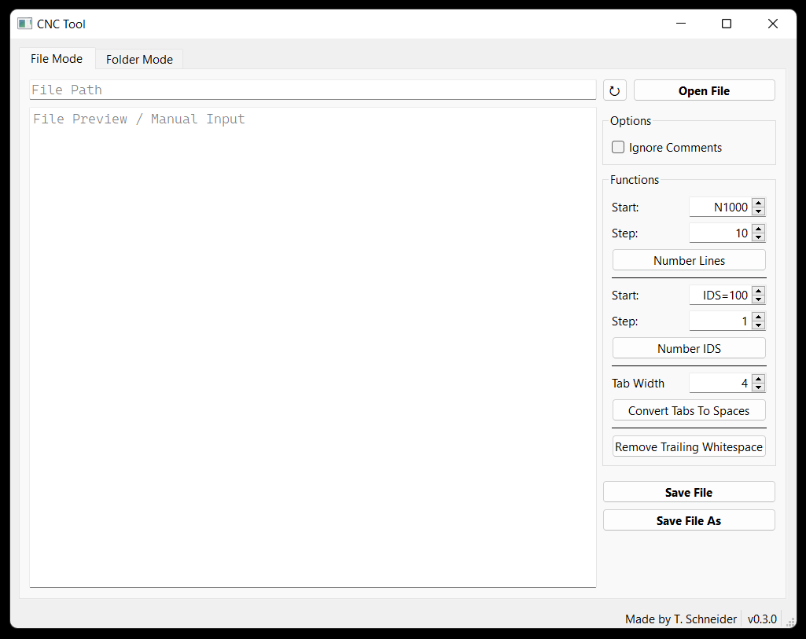

# CNC Tool

Simple helper tool for Siemens CNC programs, written in Python and Qt6 / PySide6.

Supports working with a single file or a complete folder.

## Usage

Download the latest release from the [GitHub Releases page](https://github.com/tschneiderr/cnc-tool/releases).

Unpack the folder and run `cnc-tool.exe`.
